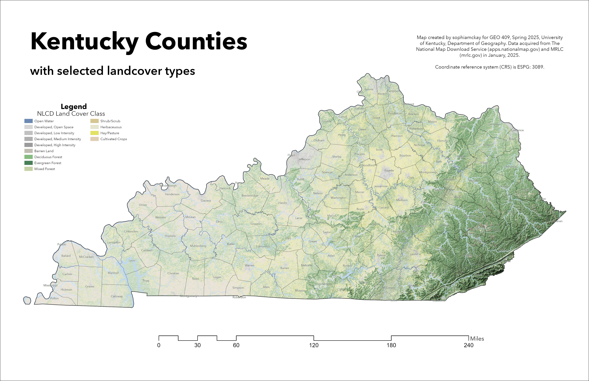
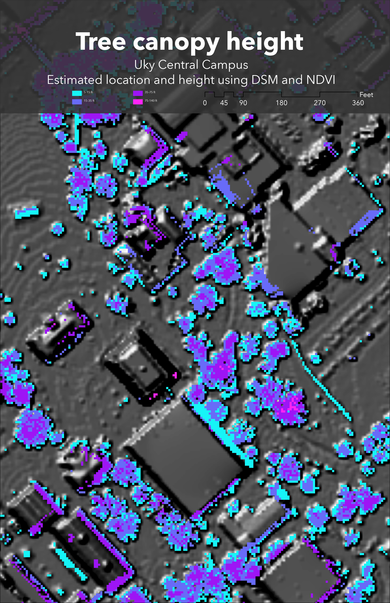

# geo409-field-trip-maps
Selected maps of Kentucky and locations therein

# GEO409 Field Trip Maps

Maps for field trip to measure tree canopy

  
Kentucky counties with selected land cover types – [Download geospatial PDF](Ky-landcover.pdf)

  
UKy central campus canopy model – [Download geospatial PDF](campus-canopy-model.pdf)

Maps created by sophiamckay for GEO409, Spring 2025, University of Kentucky Department of Geography

 https://sophiamckay.github.io/geo409-field-trip-maps/